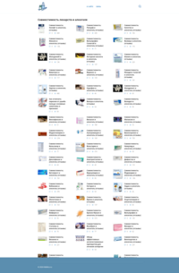
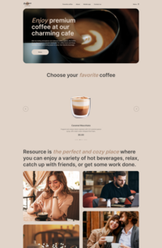
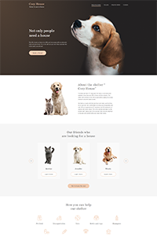

# Hi there 👋

Frontend developer with over 5 years of experience in developing a wide range of applications, from e-commerce websites to complex information systems. I have participated in <a href='https://gordienkogames.itch.io/' target='_blank'>hackathons</a> and led <a href='https://www.youtube.com/@GordienkoThings' target='_blank'>development channel</a>. In my free time, I’m working on a couple of projects: <a href='https://journal-seven-sand.vercel.app/' target='_blank'>a habit tracking service</a> and a service for frontend developers. I am looking for a company where my skills will be valuable, and I would be happy to discuss potential opportunities!

   📫 How to reach me: <a href="mailto:gordienkodev@gmail.com">gordienkodev@gmail.com</a> - <a href="https://www.linkedin.com/in/pavelgordienko/" rel="nofollow">
       LinkedIn
   </a> - <a href="https://t.me/joinchat/@gordienkodev" rel="nofollow">
       Telegram
   </a>

🔭 Completed (from newest to oldest):

- <a href="https://github.com/gordienkodev/testBeeJee" rel="nofollow">BeeJee</a> (Fullstack - React, Express)
- <a href="https://github.com/gordienkodev/steam-test" rel="nofollow">steam</a> (Next.js)
- <a href="https://github.com/gordienkodev/OpenBridgeTask" rel="nofollow">openBridge</a> (Next.js)
- <a href="https://github.com/gordienkodev/testwork07" rel="nofollow">abelo</a> (Next.js)
- <a href="https://github.com/gordienkodev/fuse8-task" rel="nofollow">fuse8</a> (React)
- <a href="https://github.com/gordienkodev/green-api-task" rel="nofollow">green-api</a> (React)
- <a href="https://github.com/gordienkodev/PokeAPI-task" rel="nofollow">pokeAPI</a> (Next.js)
- <a href="https://github.com/gordienkodev/yukids-task" rel="nofollow">yukids</a> (React)
- <a href="https://github.com/gordienkodev/WEATHER-API" rel="nofollow">weather-API</a> (React)
- <a href="https://github.com/gordienkodev/mindbox-task" rel="nofollow">mindbox</a> (React)
- <a href="https://github.com/gordienkodev/mad-soft-task" rel="nofollow">mad-soft</a> (React)
- <a href="https://github.com/gordienkodev/seotlt-task" rel="nofollow">seotlt</a> (React)
- <a href="https://github.com/gordienkodev/skilla-task" rel="nofollow">skilla</a> (React)
- <a href="https://github.com/gordienkodev/alfa-task" rel="nofollow">alfa</a> (React)

## Languages and Tools

  &nbsp;
  
  &nbsp;
  &nbsp;
  &nbsp;
  &nbsp;
  &nbsp;
  
  
  
  
  &nbsp;
  &nbsp;
  
  
  &nbsp;
  &nbsp;
  &nbsp;

## My latest projects

 
  
  
  
  

  
### CodeWars
  
  
### My Stats

 
  

  

<!--
### My Courses

 

### Sertificates

  

**gordienkodev/gordienkodev** is a ✨ _special_ ✨ repository because its `README.md` (this file) appears on your GitHub profile.
Here are some ideas to get you started:
- 🔭 I’m currently working on ...
- 🌱 I’m currently learning ...
- 👯 I’m looking to collaborate on ...
- 🤔 I’m looking for help with ...
- 💬 Ask me about ...
- 📫 How to reach me: ...
- 😄 Pronouns: ...
- ⚡ Fun fact: ...
-->
